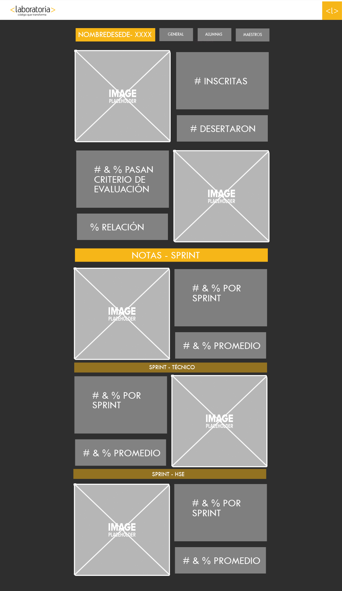
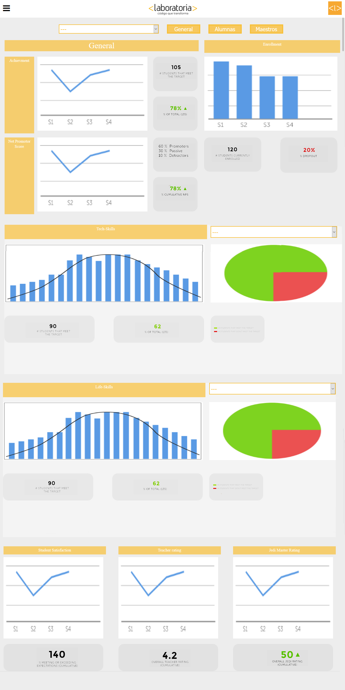
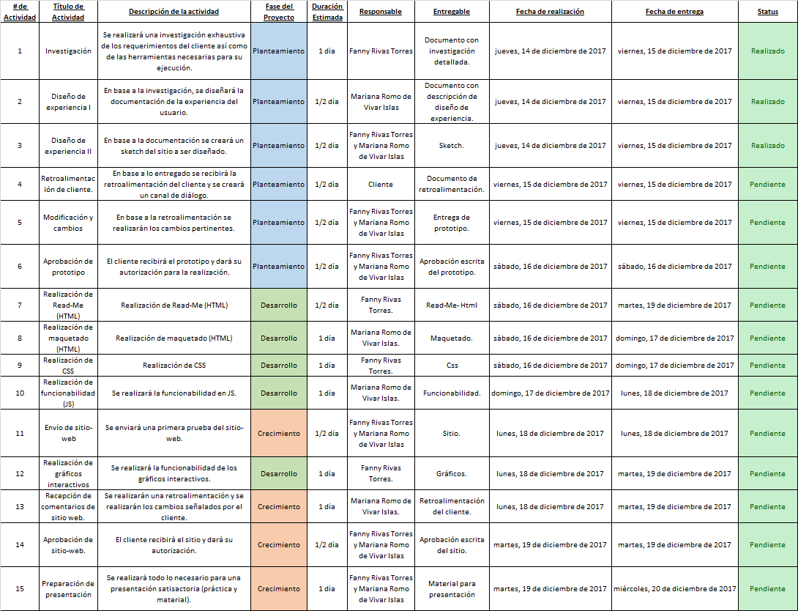

# Data Dashboard

* **Track:** _Common Core_
* **Curso:** _Creando tu primer sitio web interactivo_
* **Unidad:** _Producto final_

***
##Integrantes del equipo:

Mariana Romo de Vivar Islas. 

## Planeación 
Fase de diseño de experiencia: donde se diseña el sitio y la experiencia que se busca otorgar al usuario.

# 1.Gestión de requerimientos.//Donde se definen los usuarios, sus requerimientos, los objetivos.

**-Necesidades del cliente (usuario).**
*//¿Qué es lo que el cliente necesita?*
Nuestro usuario son las Training Managers. Ellas necesitan analizar la mayor cantidad de datos  respecto al desempeño de las estudiantes.  Necesitan ser capaces de ver la información de forma clara y concisa, con la ayuda de gráficas para poder asimilar más fácilmente los datos. 

Se nos ha pedido que la información contenida en el sitio incluya: 
	1. Total de estudiantes por sede y generación. 
	2. Porcentaje de deserción. 
	3. Cantidad de estudiantes que superan la meta de puntos en todos los sprint (y el porcentaje que representa).
	4. Net Promotor Score dividido en base a promoters, passive y detractors. 
	5. Cantidad y porcentaje de estudiantes que superan la meta de puntos técnicos por sprint y en promedio. 
	6. Cantidad y porcentaje de estudiantes que superan la meta de puntos HSE por sprint y en promedio. 
	7. Puntuación promedio de profesores.
	8. Puntuación promedio de jedis masters.
	9. Satisfacción de los estudiantes.
	
#2.Definición de los objetivo del sitio.
*//Cuál es el fin de nuestro sitio web.*
Se busca desarrollar un sitio web que cumpla con las necesidades del usuario, sea fácil de usar y que facilite la tarea de las TM proporcionando información ordenada de forma clara y con datos concisos. 

*//Cómo se vislumbramos el desempeño del sitio en el futuro.*
En vistas de que el proyecto es muy amplio y el tiempo limitado buscaremos dejar abiertas las posibilidades de incluir nueva funcionabilidad en el sitio, así como dejar listos elementos para que en un futuro se le pueda añadir nuevas características.

#3.Necesidades del proyecto.**
*//Qué es lo que necesita el proyecto para ser exitoso.*

	• Cumplir con las necesidades de los usuarios. 
	• Presentar información de forma clara. 
	• Utilización de gráficos. 
	• Diseño visual satisfactorio. 
	• Navegación fácil e intuitiva. 
	• Capacidad para implementar nuevas características a futuro.

#4. Propuesta de diseño (prototipado).
*//Donde se confecciona una maqueta del producto final.*

**-Estructura de la página web.**
*//Qué estructura va a seguir el sitio y por qué.*

La estructura básica contará de lo siguiente: 

	1. Barra de navegación. 
		a. Menu desplegable. 
			i. Log In. 
			ii. Perfil.
			iii. Configuración. 
			iv. Log Out. 
			v. Funcionabilidad adicional.
		b. Logo de laboratoria (branding). 
		c. Foto de perfil de usuario (log in).
		
	2.  Navegación global.
        a.Banner.
		b. Selector de sede y generación. 
		c. Pestañas 
			i. Vista general.
			ii. Vista alumnas. 
			iii. Vista maestros.
			
	3. Sección de contenido general (Vista general). 
		a. Enrollment. 
			i. Gráfica. 
			ii. Número de estudiantes inscritas.
			iii. Porcentaje de deserción. 
		b. Achievement. 
			i. Gráfica.
			ii. Número de estudiante que cumplen. 
			iii. Porcentaje que representan.
		c. Net Promoter Score
			i. Gráfica.
			ii. Número de promoters, passive y detractors.
			iii. Porcentaje acumulativo.
			
	4. Sección de contenido sprint-técnico.
		a. Gráfica líneal.
		b. Número de estudiante que cumplen. 
		c. Porcentaje que representan.
		d. Gráfica de pastel. 
		e. Simbología de gráfica.
		
	5. Sección de contenido sprint-HSE.
		a. Gráfica líneal.
		b. Número de estudiante que cumplen. 
		c. Porcentaje que representan.
		d. Gráfica de pastel. 
		e. Simbología de gráfica.
		
	6. Sección de satisfacción de alumnas.
	7. Calificación de maestros.
	8. Calificación de jedis. 
	

#-Diseño visual.
*//Cuál va a ser el diseño visual y por qué.*
Para la realización del sitio web se seguirán los principios del minimalismo, teniendo en cuenta que menos es más.  Se seguirán los lineamientos de la marca (branding) utilizando las mismas tipografías y paletas de colores ya pre-establecidas para buscar una uniformidad en la representación. 

#-Diseño de navegación.
*//Cuál va a ser el diseño de la navegación y por qué.*
Se realizará una navegación sencilla para que buscar que la curva de aprendizaje sea mínima y la navegación, intuitiva. Estableceremos un menú dropdown en la esquina superior izquierda con el objetivo de disminuir la saturación visual.  Colocaremos también una barra de navegación global en la que se detallarán las posibles sedes y generaciones, así como la pestaña en la que nos encontramos. 

#-Diseño de la información.
*//Qué información va a contener el sitio y por qué.*
Se buscará que la información presentada sea concisa y precisa. Presentando únicamente los datos esenciales. Para propósitos prácticos, basados en la importancia y usabilidad, la información en la vista general se dividió de la siguiente forma: 

	1. Información general de la sede. 
	2. Información de habilidades técnicas.
	3. Información de habilidades HSE.
	4. Información de estudiantes, maestros y jedis. 
	

#-Sketch.
*//Realización del sketch.*

#4. Planeación (detallada).
//Definición de actividades  (Qué necesitamos hacer, cómo lo vamos a hacer, y cuánto
tiempo nos debe de tomar hacerlo).

